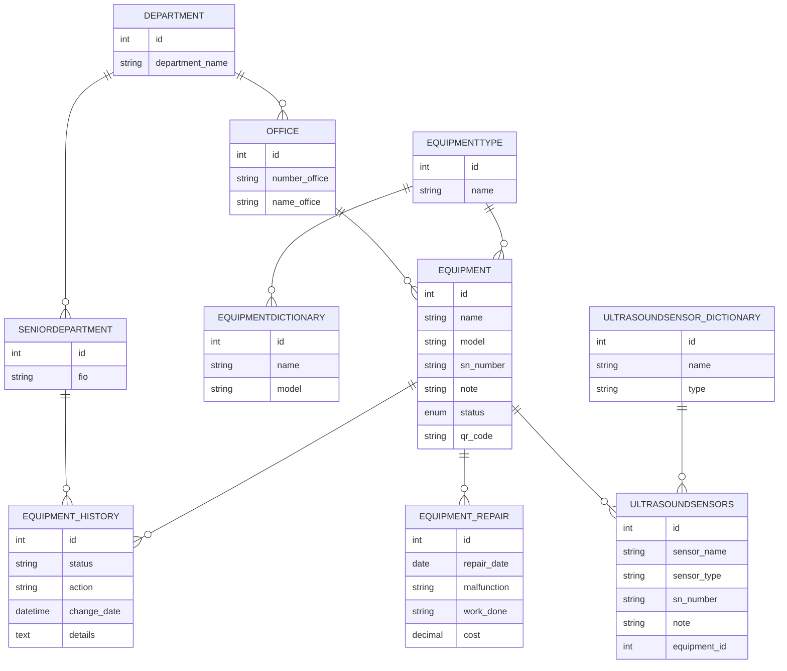

# 🧰 EquipmentApplication(update file in future)

### 🧾 Project Description
**EquipmentApplication** is a desktop JavaFX application for managing equipment within an organization.
The application allows users to track equipment locations, responsible persons, current status, repair history, and generate QR codes for quick identification. It also integrates with a Telegram bot, allowing equipment information to be accessed directly from a mobile device.


---

### 🎯 Project Goal
TThe main goal is to simplify equipment registration, inventory management, and maintenance tracking.

You can:

- 📍 View all equipment and its current location
- 👤 Assign responsible persons
- 🔄 Change equipment status (installed, stored, written off)
- 🧾 Add, edit, and delete equipment
- 🔍 Search equipment by different parameters
- 🏷️ Generate unique QR codes for every equipment item
- 🖨️ Print QR labels for equipment
- 👁️ View QR codes directly inside the application
- 🛠️ Maintain complete repair history
- 📅 Record repair dates, malfunctions, performed work, and repair costs
- 📱 Scan QR codes using a Telegram bot
- 🚚 Move equipment between offices directly from Telegram
- 📖 View repair history through Telegram
- 📊 Generate Excel reports

---

### ⚙️ Technologies Used

- ☕ **Java 17**
- 🎨 **JavaFX**
- 🗄️ **MySQL**
- 📦 **Maven**
- 🧩 **DAO / DTO architecture**
- 📄 **Apache POI** — Excel report generation
- 🏷️ **ZXing** — QR code generation
- 🤖 **Telegram Bots API** — mobile interaction with the system
- 📡 **Jackson Databind** — JSON processing
- 📑 **JUnit 5** — testing
- 📝 **Log4j 2** — logging

---

### 📁 Project Structure
```text
src/java/com/example/equipmentapplication/
├── config/
│ └── Config.java
│
├── dao/
│ ├── DepartmentDAO.java
│ ├── EquipmentDAO.java
│ ├── EquipmentDictionaryDAO.java
│ ├── EquipmentHistoryDAO.java
│ ├── EquipmentRepairDAO.java
│ ├── EquipmentTypeDAO.java
│ ├── OfficeDAO.java
│ ├── SeniorDepartmentDAO.java
│ ├── UltrasoundSensorDAO.java
│ └── UltrasoundSensorDictionaryDAO.java
│
├── dto/
│ ├── Department.java
│ ├── Equipment.java
│ ├── EquipmentDictionary.java
│ ├── EquipmentHistory.java
│ ├── EquipmentRepair.java
│ ├── EquipmentType.java
│ ├── MainRecord.java
│ ├── Office.java
│ ├── SeniorDepartment.java
│ ├── UltrasoundSensor.java
│ └── UltrasoundSensorDictionary.java
│
├── telegramBot/
│ ├── BotStarter.java
│ └── EquipmentBot.java
│
├── util/
│ ├── AlertUtils.java
│ ├── QRCodeGenerator.java
│ ├── QRCodeViewer.java
│ └── WindowUtils.java
│
├── window/
│ ├── DepartmentWindow.java
│ ├── EquipmentDictionaryWindow.java
│ ├── EquipmentHistoryWindow.java
│ ├── EquipmentRepairWindow.java
│ ├── EquipmentTypeWindow.java
│ ├── EquipmentWindow.java
│ ├── LoadingWindow.java
│ ├── MainWindow.java
│ ├── OfficeWindow.java
│ ├── SeniorDepartmentWindow.java
│ ├── UltrasoundSensorDictionaryWindow.java
│ └── UltrasoundSensorWindow.java
│
├── DatabaseHelper.java
├── FieldValidator.java
└── HelloApplication.java

src/java/resources/
```
---

### 🧠 Database Diagram (ER Model)

---
🖼️ Interface Example

---
👨‍💻 Author
- Author: Evgeny Dantsov
- License: MIT
- Project type: Work-use application
